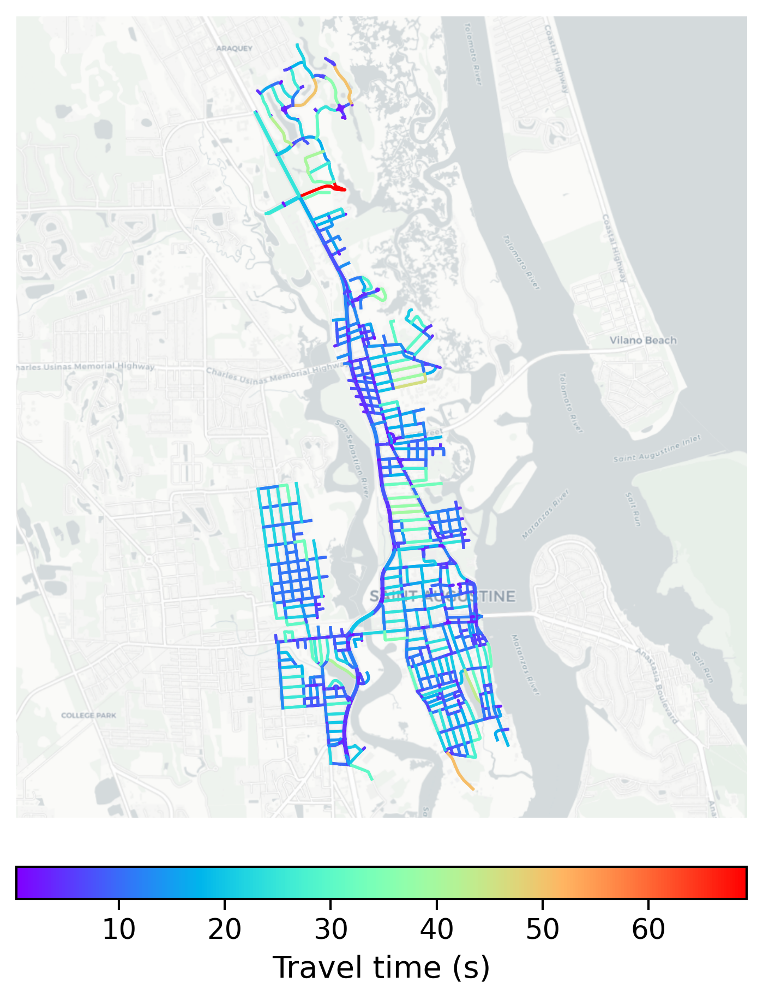

# St_Augustine, USA

#### Location Information

- **City**: St_Augustine
- **Country**: USA
- **Data Source**: OpenStreetMap

- **Analysis Date**: 2025-10-10

#### Road network topology

#### Network Characteristics

##### Basic Topology

- **Number of Nodes**: 774
- **Number of Edges**: 1,988
- **Network Density**: 0.003323
- **Average Node Degree**: 5.137
- **Standard Deviation of Node Degrees**: 1.779

##### Clustering Properties

- **Global Clustering Coefficient**: 0.062547
- **Average Local Clustering Coefficient**: 0.065502
- **Degree Assortativity Coefficient**: 0.309317

##### Spatial Metrics

- **Total Network Length (meters)**: 198905.57
- **Average Edge Length (meters)**: 100.05
- **Average Travel Time per Edge (seconds)**: 10.51

---
*Report generated on 2025-10-10 18:31:13*
