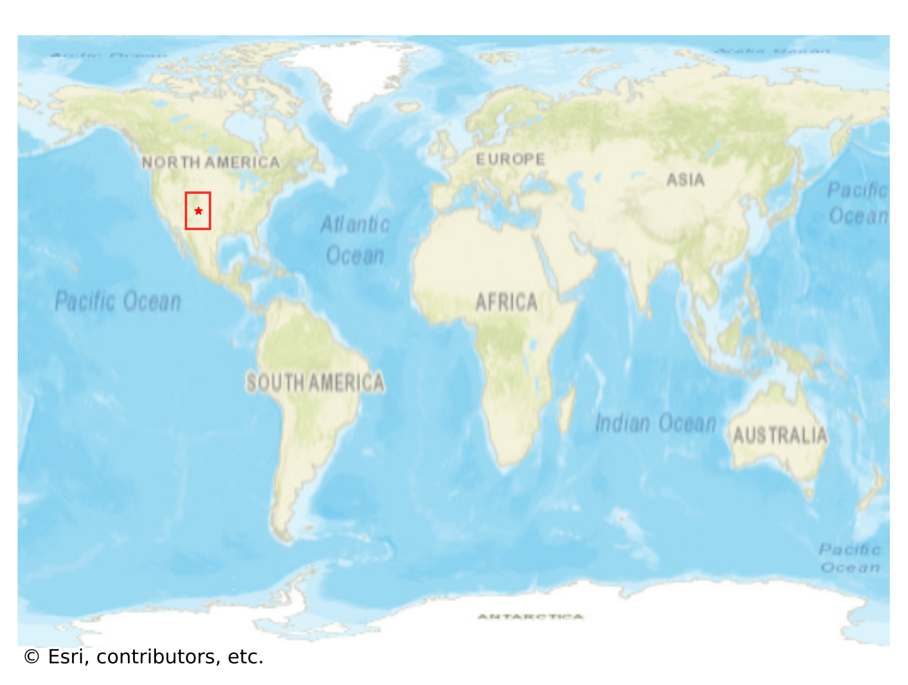

# Taos_Pueblo, USA

#### Location Information

- **City**: Taos_Pueblo
- **Country**: USA
- **Data Source**: OpenStreetMap

- **Analysis Date**: 2025-10-09

#### Road network topology

#### Network Characteristics

##### Basic Topology

- **Number of Nodes**: 486
- **Number of Edges**: 1,138
- **Network Density**: 0.004828
- **Average Node Degree**: 4.683
- **Standard Deviation of Node Degrees**: 1.951

##### Clustering Properties

- **Global Clustering Coefficient**: 0.056943
- **Average Local Clustering Coefficient**: 0.056237
- **Degree Assortativity Coefficient**: -0.121907

##### Spatial Metrics

- **Total Network Length (meters)**: 296008.97
- **Average Edge Length (meters)**: 260.11
- **Average Travel Time per Edge (seconds)**: 34.04

---
*Report generated on 2025-10-09 19:22:21*
