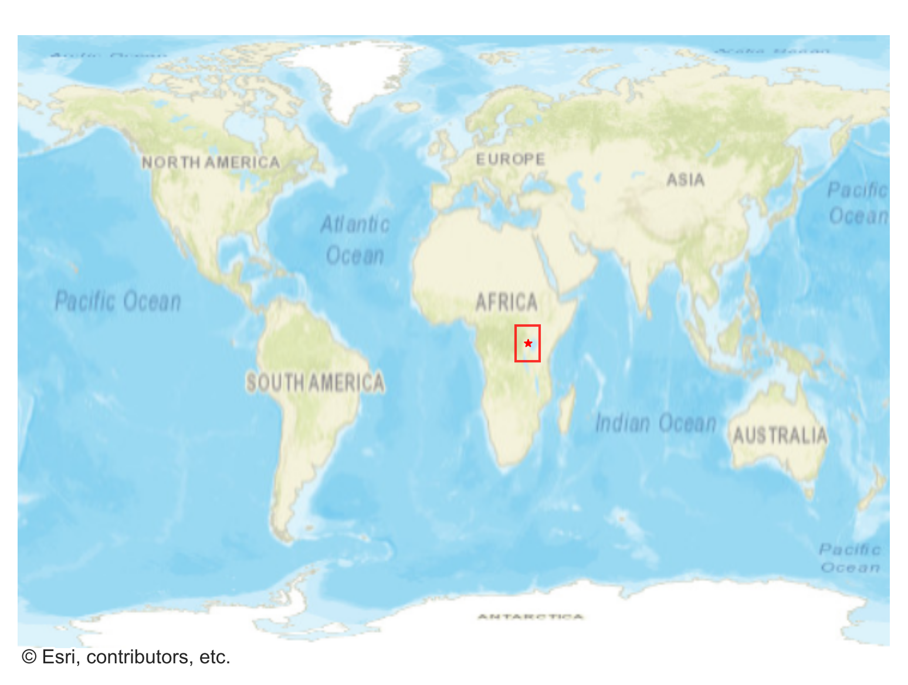
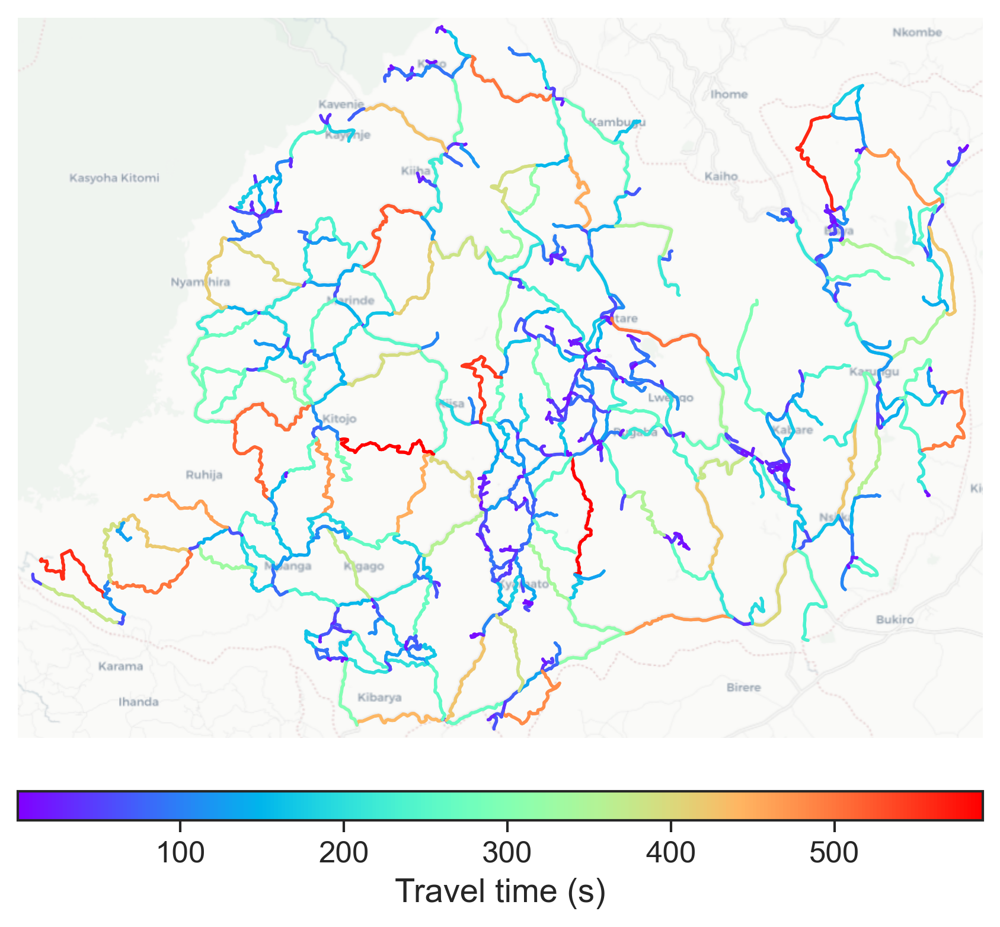

# Buhweju, Uganda

#### Location Information

- **City**: Buhweju
- **Country**: Uganda
- **Data Source**: OpenStreetMap

- **Analysis Date**: 2025-10-09

#### Road network topology

#### Network Characteristics

##### Basic Topology

- **Number of Nodes**: 629
- **Number of Edges**: 1,488
- **Network Density**: 0.003767
- **Average Node Degree**: 4.731
- **Standard Deviation of Node Degrees**: 1.966

##### Clustering Properties

- **Global Clustering Coefficient**: 0.044049
- **Average Local Clustering Coefficient**: 0.042824
- **Degree Assortativity Coefficient**: -0.136914

##### Spatial Metrics

- **Total Network Length (meters)**: 1247190.03
- **Average Edge Length (meters)**: 838.17
- **Average Travel Time per Edge (seconds)**: 100.58

---
*Report generated on 2025-10-09 19:21:44*
