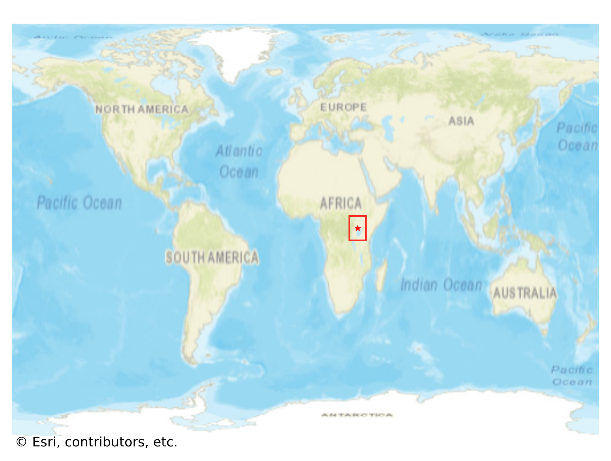
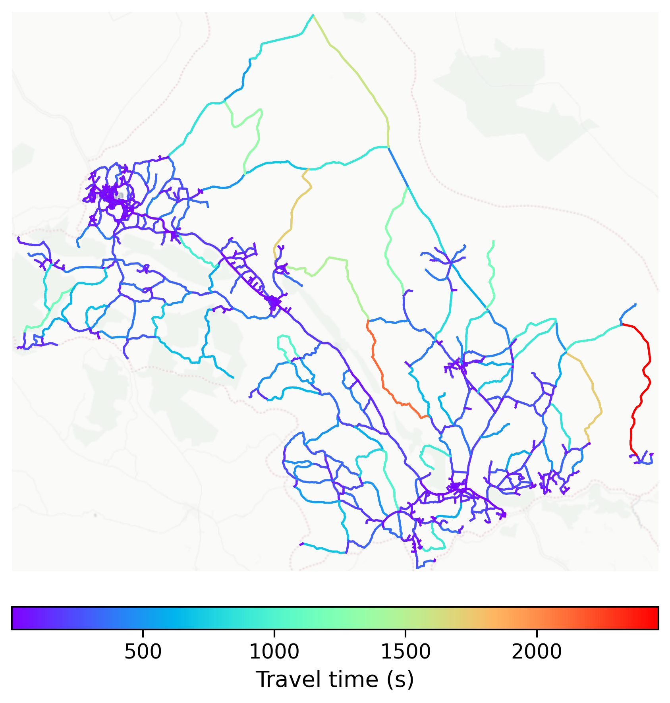

# Kiboga, Uganda

#### Location Information

- **City**: Kiboga
- **Country**: Uganda
- **Data Source**: OpenStreetMap

- **Analysis Date**: 2025-10-10

#### Road network topology

#### Network Characteristics

##### Basic Topology

- **Number of Nodes**: 828
- **Number of Edges**: 2,116
- **Network Density**: 0.003090
- **Average Node Degree**: 5.111
- **Standard Deviation of Node Degrees**: 1.751

##### Clustering Properties

- **Global Clustering Coefficient**: 0.046368
- **Average Local Clustering Coefficient**: 0.044703
- **Degree Assortativity Coefficient**: -0.063651

##### Spatial Metrics

- **Total Network Length (meters)**: 1859068.70
- **Average Edge Length (meters)**: 878.58
- **Average Travel Time per Edge (seconds)**: 135.20

---
*Report generated on 2025-10-10 18:30:04*
