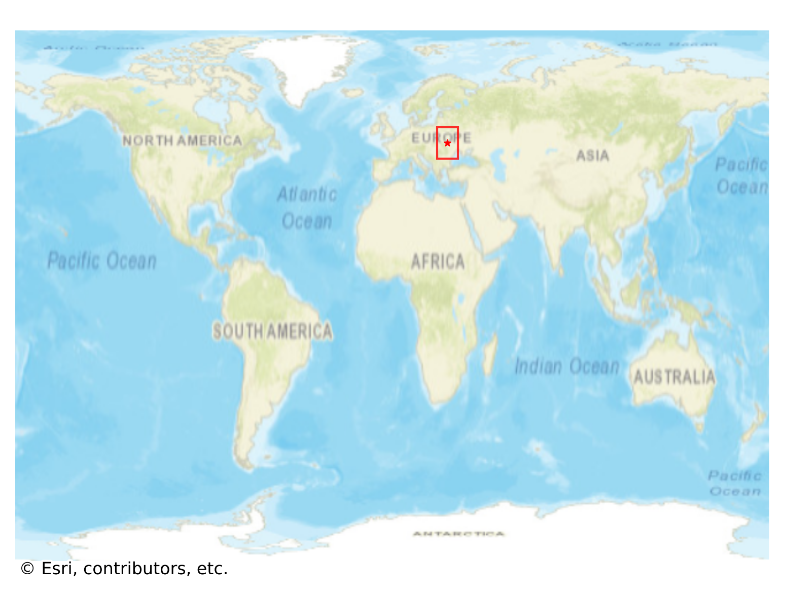

# Husiatyn, Ukraine

#### Location Information

- **City**: Husiatyn
- **Country**: Ukraine
- **Data Source**: OpenStreetMap

- **Analysis Date**: 2025-10-10

#### Road network topology

#### Network Characteristics

##### Basic Topology

- **Number of Nodes**: 112
- **Number of Edges**: 272
- **Network Density**: 0.021879
- **Average Node Degree**: 4.857
- **Standard Deviation of Node Degrees**: 1.772

##### Clustering Properties

- **Global Clustering Coefficient**: 0.089552
- **Average Local Clustering Coefficient**: 0.090038
- **Degree Assortativity Coefficient**: 0.040209

##### Spatial Metrics

- **Total Network Length (meters)**: 81637.74
- **Average Edge Length (meters)**: 300.14
- **Average Travel Time per Edge (seconds)**: 36.02

---
*Report generated on 2025-10-10 18:30:10*
