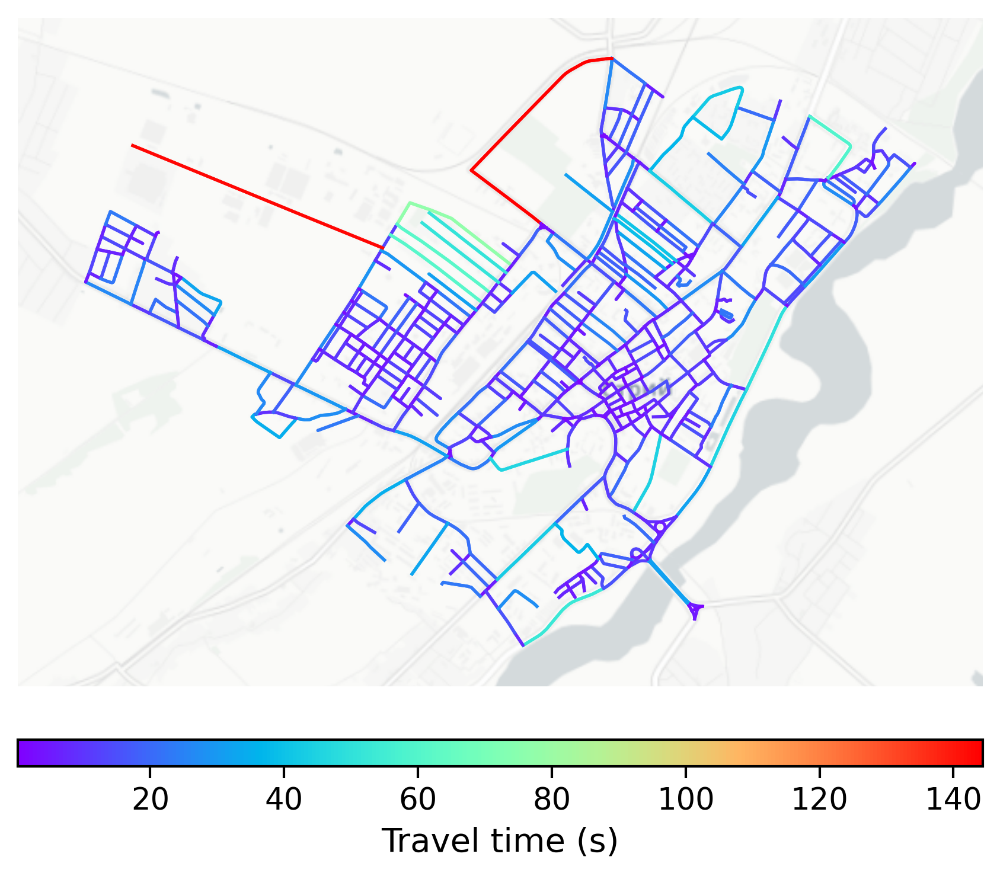

# Stryi, Ukraine

#### Location Information

- **City**: Stryi
- **Country**: Ukraine
- **Data Source**: OpenStreetMap

- **Analysis Date**: 2025-10-10

#### Road network topology

#### Network Characteristics

##### Basic Topology

- **Number of Nodes**: 510
- **Number of Edges**: 1,337
- **Network Density**: 0.005150
- **Average Node Degree**: 5.243
- **Standard Deviation of Node Degrees**: 1.705

##### Clustering Properties

- **Global Clustering Coefficient**: 0.061589
- **Average Local Clustering Coefficient**: 0.056929
- **Degree Assortativity Coefficient**: 0.216151

##### Spatial Metrics

- **Total Network Length (meters)**: 211330.62
- **Average Edge Length (meters)**: 158.06
- **Average Travel Time per Edge (seconds)**: 11.56

---
*Report generated on 2025-10-10 18:30:12*
