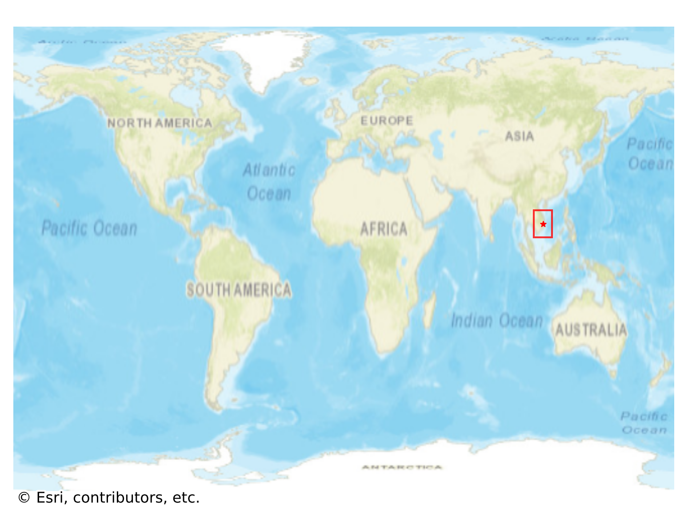
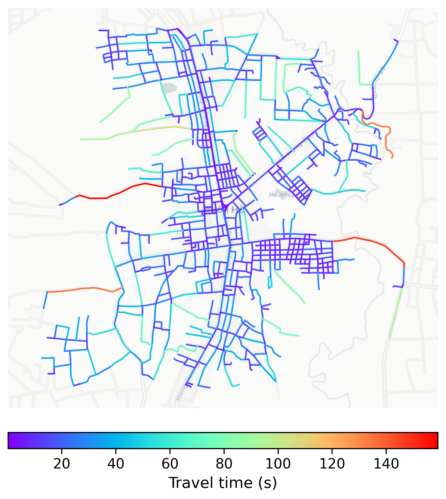

# Buon_Ho, Vietnam

#### Location Information

- **City**: Buon_Ho
- **Country**: Vietnam
- **Data Source**: OpenStreetMap

- **Analysis Date**: 2025-10-10

#### Road network topology

#### Network Characteristics

##### Basic Topology

- **Number of Nodes**: 770
- **Number of Edges**: 2,084
- **Network Density**: 0.003519
- **Average Node Degree**: 5.413
- **Standard Deviation of Node Degrees**: 1.905

##### Clustering Properties

- **Global Clustering Coefficient**: 0.029242
- **Average Local Clustering Coefficient**: 0.030446
- **Degree Assortativity Coefficient**: 0.190915

##### Spatial Metrics

- **Total Network Length (meters)**: 311756.80
- **Average Edge Length (meters)**: 149.60
- **Average Travel Time per Edge (seconds)**: 17.46

---
*Report generated on 2025-10-10 18:31:19*
