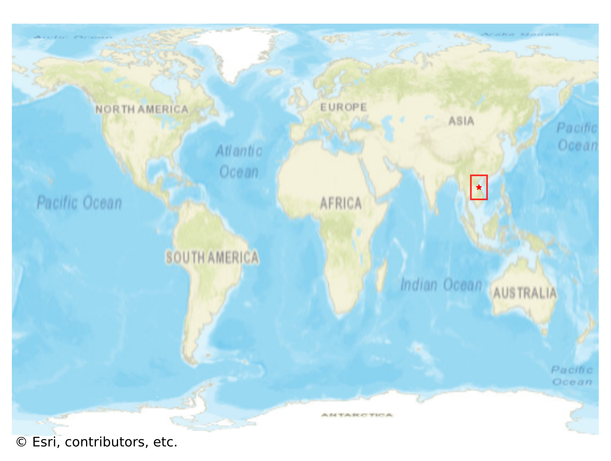
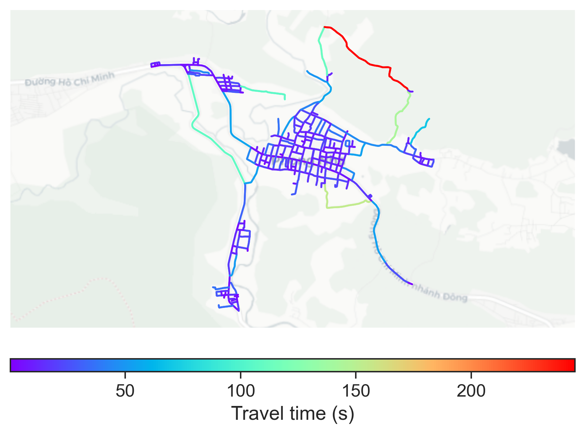

# Phong_Nha, Vietnam

#### Location Information

- **City**: Phong_Nha
- **Country**: Vietnam
- **Data Source**: OpenStreetMap

- **Analysis Date**: 2025-10-10

#### Road network topology

#### Network Characteristics

##### Basic Topology

- **Number of Nodes**: 290
- **Number of Edges**: 794
- **Network Density**: 0.009474
- **Average Node Degree**: 5.476
- **Standard Deviation of Node Degrees**: 1.730

##### Clustering Properties

- **Global Clustering Coefficient**: 0.022642
- **Average Local Clustering Coefficient**: 0.028354
- **Degree Assortativity Coefficient**: 0.014174

##### Spatial Metrics

- **Total Network Length (meters)**: 115113.24
- **Average Edge Length (meters)**: 144.98
- **Average Travel Time per Edge (seconds)**: 15.14

---
*Report generated on 2025-10-10 16:14:02*
