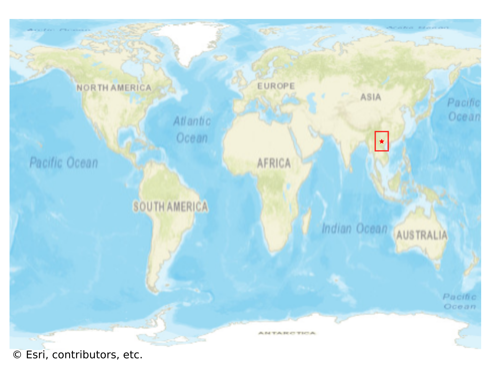
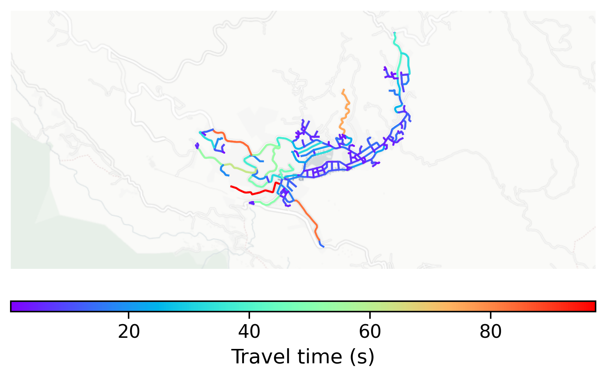

# Sapa, Vietnam

#### Location Information

- **City**: Sapa
- **Country**: Vietnam
- **Data Source**: OpenStreetMap

- **Analysis Date**: 2025-10-10

#### Road network topology

#### Network Characteristics

##### Basic Topology

- **Number of Nodes**: 195
- **Number of Edges**: 423
- **Network Density**: 0.011182
- **Average Node Degree**: 4.338
- **Standard Deviation of Node Degrees**: 1.886

##### Clustering Properties

- **Global Clustering Coefficient**: 0.066502
- **Average Local Clustering Coefficient**: 0.072682
- **Degree Assortativity Coefficient**: -0.113473

##### Spatial Metrics

- **Total Network Length (meters)**: 48694.59
- **Average Edge Length (meters)**: 115.12
- **Average Travel Time per Edge (seconds)**: 11.96

---
*Report generated on 2025-10-10 18:31:23*
