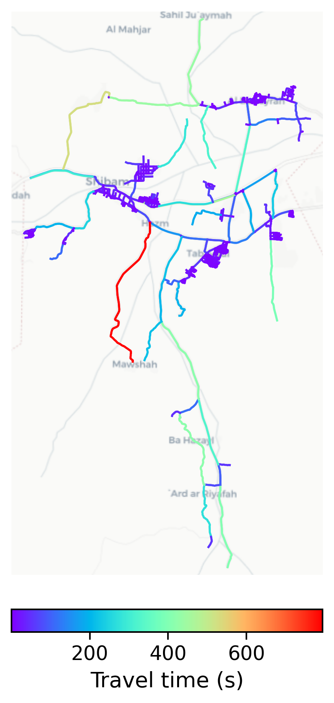

# Shibam, Yemen

#### Location Information

- **City**: Shibam
- **Country**: Yemen
- **Data Source**: OpenStreetMap

- **Analysis Date**: 2025-10-10

#### Road network topology

#### Network Characteristics

##### Basic Topology

- **Number of Nodes**: 762
- **Number of Edges**: 2,099
- **Network Density**: 0.003620
- **Average Node Degree**: 5.509
- **Standard Deviation of Node Degrees**: 2.112

##### Clustering Properties

- **Global Clustering Coefficient**: 0.048490
- **Average Local Clustering Coefficient**: 0.052515
- **Degree Assortativity Coefficient**: 0.083681

##### Spatial Metrics

- **Total Network Length (meters)**: 319947.24
- **Average Edge Length (meters)**: 152.43
- **Average Travel Time per Edge (seconds)**: 18.29

---
*Report generated on 2025-10-10 16:14:10*
