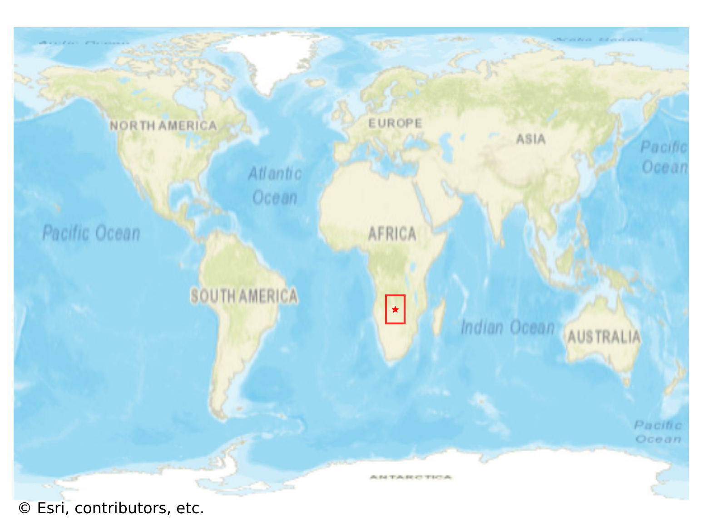
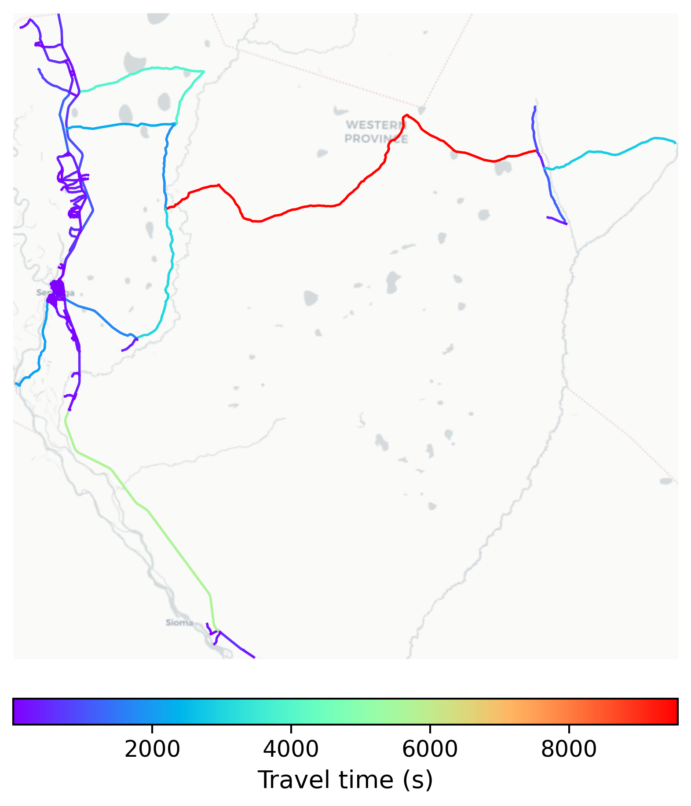

# Senanga, Zambia

#### Location Information

- **City**: Senanga
- **Country**: Zambia
- **Data Source**: OpenStreetMap

- **Analysis Date**: 2025-10-10

#### Road network topology

#### Network Characteristics

##### Basic Topology

- **Number of Nodes**: 462
- **Number of Edges**: 1,292
- **Network Density**: 0.006066
- **Average Node Degree**: 5.593
- **Standard Deviation of Node Degrees**: 1.684

##### Clustering Properties

- **Global Clustering Coefficient**: 0.070242
- **Average Local Clustering Coefficient**: 0.069975
- **Degree Assortativity Coefficient**: 0.010811

##### Spatial Metrics

- **Total Network Length (meters)**: 1205287.34
- **Average Edge Length (meters)**: 932.88
- **Average Travel Time per Edge (seconds)**: 111.95

---
*Report generated on 2025-10-10 15:38:12*
