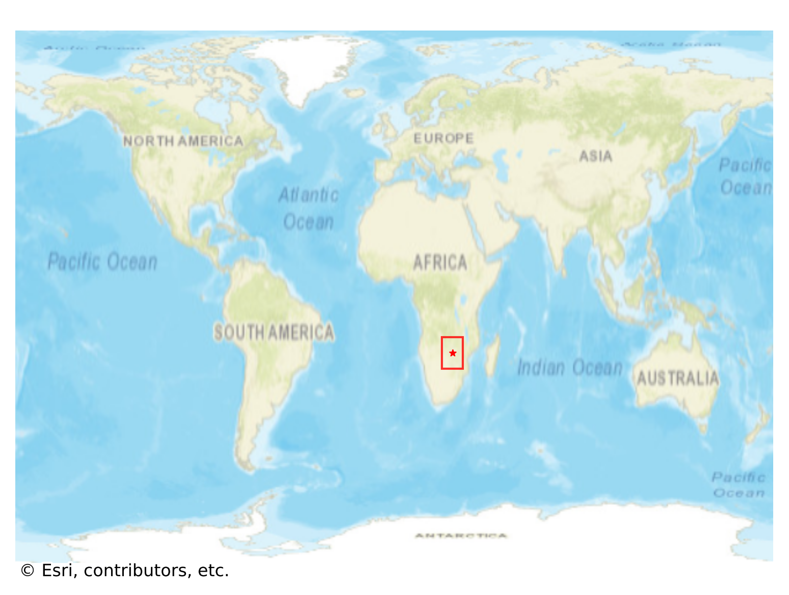
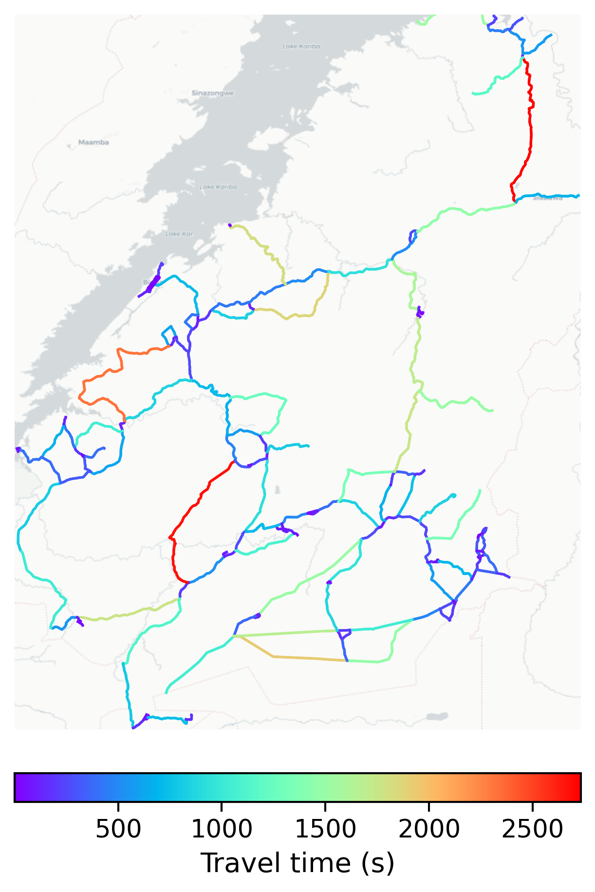

# Binga, Zimbabwe

#### Location Information

- **City**: Binga
- **Country**: Zimbabwe
- **Data Source**: OpenStreetMap

- **Analysis Date**: 2025-10-10

#### Road network topology

#### Network Characteristics

##### Basic Topology

- **Number of Nodes**: 247
- **Number of Edges**: 660
- **Network Density**: 0.010862
- **Average Node Degree**: 5.344
- **Standard Deviation of Node Degrees**: 1.632

##### Clustering Properties

- **Global Clustering Coefficient**: 0.113793
- **Average Local Clustering Coefficient**: 0.113636
- **Degree Assortativity Coefficient**: -0.026520

##### Spatial Metrics

- **Total Network Length (meters)**: 2523321.30
- **Average Edge Length (meters)**: 3823.21
- **Average Travel Time per Edge (seconds)**: 261.55

---
*Report generated on 2025-10-10 15:38:15*
